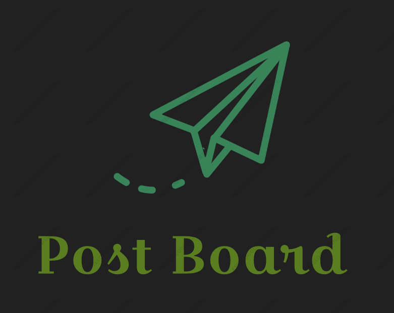
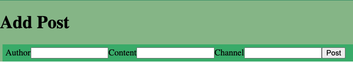
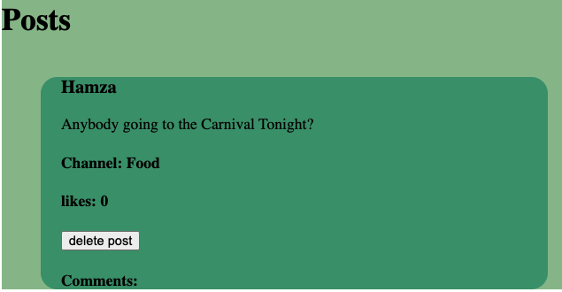

# Post Board
### Date Started: 08/27/21
### By: Raza Khalid 
[Trello Link](https://trello.com/b/R7CNqJVD/post-board)

---

>### **Description**

Post Board is a communication tool you can use to make any annoucement or post about anything you want. Post Board makes it easier for you to share you thoughts with your colleagues, family, friends, students, etc. 

---

>### **Technologies Used**
* Mongodb
* Express.js
* React.js
* Node.js
  
  

---
>### **Nav Bar**

Nav Bar makes it easy for the user to navigate between different pages quicker. 

----

>### **Add a Post**

Simply navigate to the Home page and Start adding your posts by filling out the form.  

----

>### **Post**

Navigate to the "All Post" page and look at your post. 

----

>### **Add a Post**

Simply navigate to the Home page and Start adding your posts by filling out the form.  

----

>### **Delete Post**

made a typo? or changed your mind? dont worry simply navigate to the "Delete post" page or and press Delete Post'

----

>### **Task List**
- [ ] Design Frontend with React
- [ ] Utilize mongoDb to make a database 
- [ ] Create Routes and controllers using Express
- [ ] perform CRUD operations 
- [ ]  Deploy Using Heroku

---

>### **Credits**
- [ ] [Lucid Chart](https://www.lucidchart.com/pages/templates/ui-mockup/lucidchart-login-or-sign-up-page-wireframe)  

- [ ] [Free Logo Desing](https://editor.freelogodesign.org/en/logo/edit/c30ac36c06d2407dbe46d30655c3866b?template=1501872&tab=main)  

---

