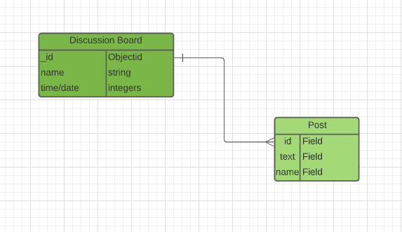
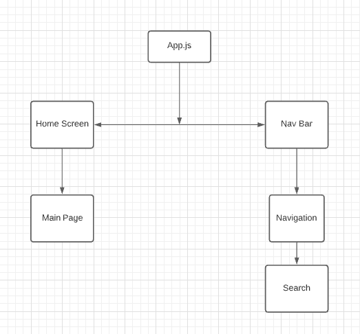

# Post Board
### Date Started: 08/27/21
### By: Raza Khalid 
[Trello Link](https://trello.com/b/R7CNqJVD/post-board)

---

>### **Description**

Post Board is a communication tool you can use to make any annoucement or post about anything you want. Post Board makes it easier for you to share you thoughts with your colleagues, family, friends, students, etc. 

---

>### **Technologies Used**
* Mongodb
* Express.js
* React.js
* Node.js

---

>### **Entity Relationship Diagram**

The database will take in the senders information. Also, the information related to the messages being posted. Data will be denormalized using one to many relationship connecting a single user to multiple message posts. Entries will be connected by a generated Obhject ID. 

---

>### **Component Hierarchy Diagram**

Component Hierarchy Diagram is there to make it easier for the author to visually see the structring of the files. 

---

>### **Task List**
- [ ] Design Frontend with React
- [ ] Utilize mongoDb to make a database 
- [ ] Create Routes and controllers using Express
- [ ] perform CRUD operations 
- [ ]  Deploy Using Heroku

---

>### **Credits**
- [ ] [Lucid Chart](https://www.lucidchart.com/pages/templates/ui-mockup/lucidchart-login-or-sign-up-page-wireframe)  

---

